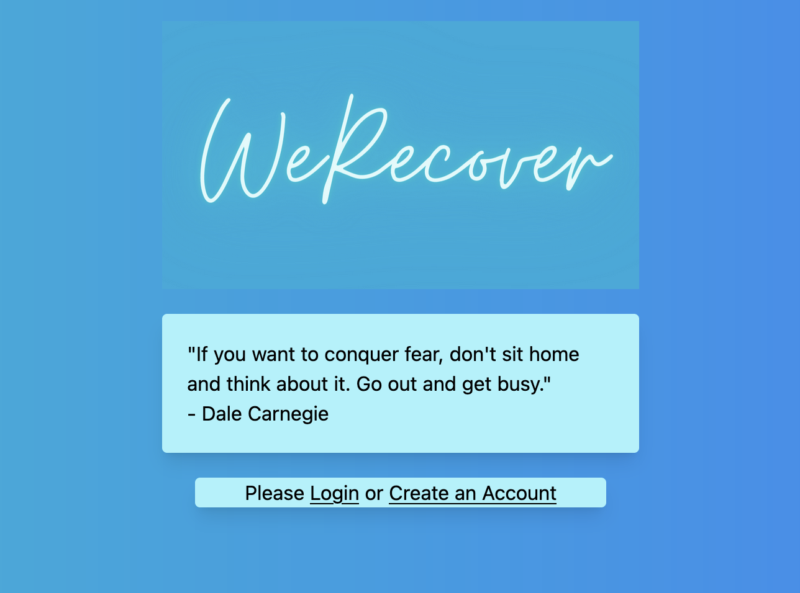
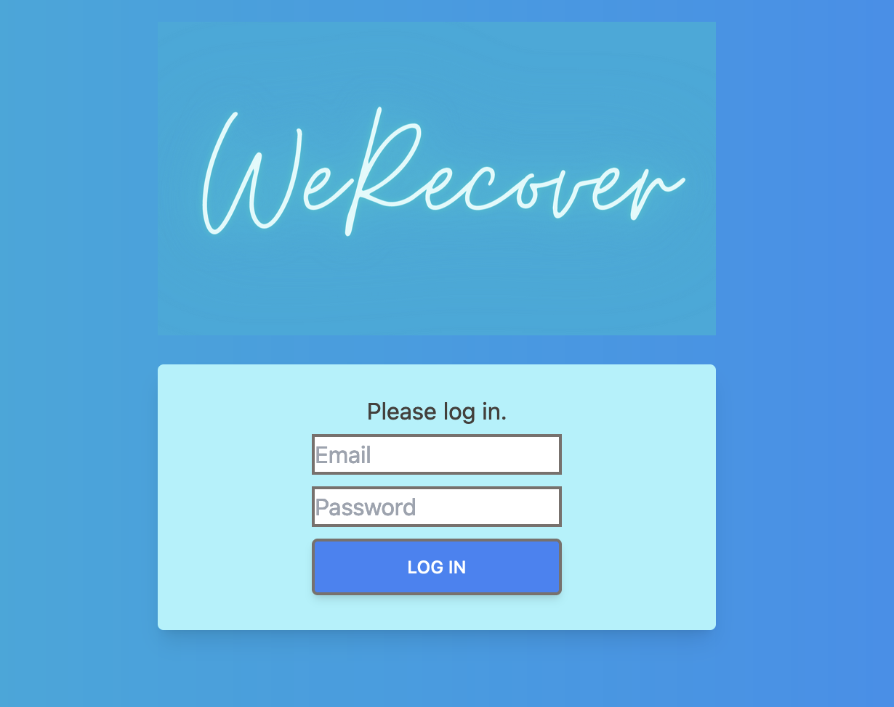
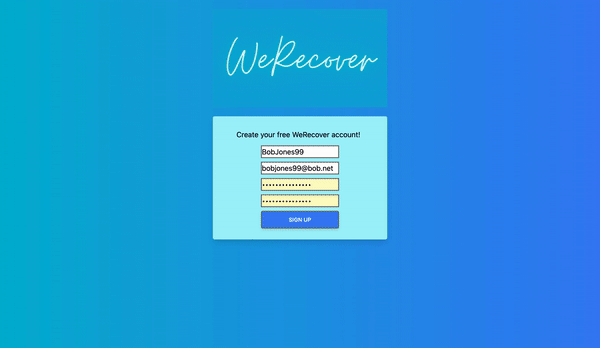

WeRecover

===

## Introduction

This is a tool for motivation and self-betterment.

WeRecover is built using an Model-View-Controller design pattern in Node.js, MongoDB, and Express.

User can input their daily journal entry or daily feelings inventory, mood,  exercise, and alcohol intake. The user can then view progress over time

---

## Who is this for?

This is intended for use by those looking to increase motivation and self-awareness or as an companion to cognitive-behavioral journaling and tracking.

---

## Packages/Dependencies used

bcrypt, connect-mongo, dotenv, ejs, express, express-flash, express-session, mongodb, mongoose, morgan, nodemon, passport, passport-local, tailwindcss, validator

---

## Optimizations

  - Add sorting features
  - Add graphical summaries
  - Add media
  - Add ability to edit journal entries
  - Night Mode

---

## Screenshots

